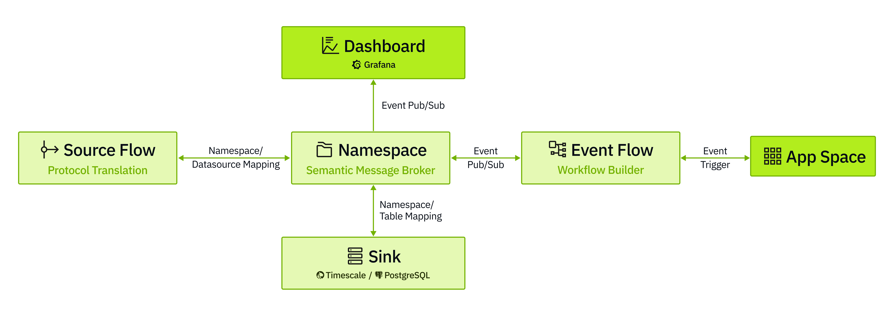

# supOS: An Open-Source IIoT Platform

[](https://supos.ai/trial)
[](https://suposcommunity.vercel.app)
[](./LICENSE)

**supOS** is an open-source industrial data integration platform built on the **Unified Namespace (UNS)** methodology and powered by production-grade open-source technologies.


---

## Architecture Overview


- **Source Flow**  
  Serves as the connection pipeline to devices and systems. It handles real-time protocol translation into JSON payloads. Built entirely on Node-RED.

- **Namespace**  
  The core of supOS. A semantic MQTT broker and parser that models data using topic hierarchies and structured JSON payloads.

- **Sink**  
  The storage layer of supOS.  
  - Time-series Namespace values are stored in **TimescaleDB**.  
  - Relational Namespace values (e.g., CRM data) are stored in **PostgreSQL**.  
  This enables efficient querying and compression.

- **Event Flow**  
  Orchestrates Namespaces into higher-level event/information flows. Supports merging JSON payloads and appending system-generated prompts for LLM-powered optimization.

---

## Hardware Requirements

|             | Minimum Requirement                  | Recommended Requirement                       |
|-------------|--------------------------------------|-----------------------------------------------|
| CPU         | 4 cores                              | 8 cores                                       |
| Memory      | 8 GB                                 | 16 GB                                         |
| Disk        | 100 GB, 1000 IOPS (30% random write)      | 1 TB, 2000 IOPS (30% random write)        |
| Browser     | Chrome 89, Edge 89, Firefox 89, Safari 15 | Chrome 89, Edge 89, Firefox 89, Safari 15 |

## Deployment
> For detailed guides and advanced examples, see the <a href="https://suposcommunity.vercel.app/">supOS Community Docs</a>.
### 1.Linux
#### 1.1 Operating Environment
- **Operating System**: Currently tested on Ubuntu Server 24.04 with Docker. We welcome feedback on other OS distributions.
- **Docker**: We assume you have Docker (with `docker compose` and `buildx`) installed. Our tested versions:
  - Docker Engine - Community: 27.4.0
  - Docker Buildx: v0.19.2
  - Docker Compose: v2.31.0
  - containerd: 1.7.24
    
#### 1.2 Installing supOS
1. Clone the project.
   ```bash
   git clone <this repo>
   ```
2. Navigate to the `supOS-CE` directory and edit environment variables in the `.env` file.
   ```bash
   cd supOS-CE
   vi .env
   ```
   - Update `VOLUMES_PATH` (directory for storing project data).
   - Update `ENTRANCE_DOMAIN` (frontend entry domain/IP address).
   - Modify other variables as needed.
3. Install supOS.
   ```bash
   bash bin/install.sh
   ```
### 2.Windows
#### 2.1 Operating Environment
- Install the latest version of **Docker Desktop** and **Git** on Windows 10 or Windows 11.
- It is recommended to perform all operations in **Git Bash** for better compatibility.
#### 2.2 Installing supOS
1. Clone the project using **Git Bash**.
   ```bash
   git clone <this repo>
   ```
2. Navigate to the `supOS-CE` directory and edit environment variables in the `.env` file.
   ```bash
   cd supOS-CE
   vi .env
   ```
   - Update `OS_PLATFORM_TYPE` = windows
   - Update `VOLUMES_PATH` (directory for storing project data).
   - Update `ENTRANCE_DOMAIN`  (Do not use 127.0.0.1 or localhost, otherwise login and authentication functions **will NOT** work.)
   - Modify other variables as required by the system.
3. Install supOS.
   ```bash
   bash bin/install.sh
   ```
### 3. Access the Platform
   1. Visit `http://<YOUR-DOMAIN>:<YOUR-PORT>` in your browser (based on ENTRANCE_DOMAIN and ENTRANCE_PORT in `.env`).
   2. Sign in to supOS-CE with default account and password: `supos/supos`.
---

## Important Startup Operations
### 1. UNS Data Model Creation
#### 1.1 Building Models Manually
> `Factory/workshop/equipment/CNC` will be used as an example, in which `Factory`, `workshop` and `equipment` are paths and `CNC` is a topic.
1. Log in to supOS, and then select **UNS** > **Namespace**.
2. Under **Topic**, click  to add a path (e.g. `factory`).


3. Select **equipment**, and then click  to add a topic (e.g.`CNC`) under it.


4. Enter the information of the topic, and then click **Next**.
5. Select **Enable History** to store data to database, and then click **Save**.


#### 1.2 Converting Models through MQTT
1. Use an MQTT client to connect to the internal broker of supOS-CE.
  - **Host**: Your supOS-CE domain.
  - **Port**: 1883.


2. Define a topic and message payload on the client, and then send it to supOS.


3. Log in to supOS, and then select **UNS** > **Namespace**.
4. Expand **Unmodeled Topics**, find the topic you defined.
5. Click **Convert** icon next to the topic, and then edit the information and complete the model creation.


#### 1.3 Importing Models
1. Log in to supOS, and then select **UNS** > **Namespace**.
2. Click **Import** at the upper-right corner, and then click **Download Template**.


3. Download the template and enter the model content according to template rules.
> You can manually add a path and topic, export it and use it as an example for import.
- Through Excel File


- Through JSON File


### 2. Model Data Source Connection
> Connect real data to make models alive.
1. Log in to supOS, go to **UNS** > **Namespace**, and under the **Topic** tab, select a file.
2. Scroll down to **Topology**, click the icon on **Source Flow** to redirect to the generated data flow under **Source Flow**.


3. Change the data source of the generated flow.


4. Deploy and trigger the flow.
---
## License
This project is licensed under the [Apache 2.0 License](./LICENSE).

## Support & Contact
- 📖 [Documentation](https://suposcommunity.vercel.app)  
- 🐞 [GitHub Issues](./issues)

## Contributors
We gratefully acknowledge the following individuals for their contributions to supOS-CE:

**Wenhao Yu**, **Liebo**, **Weipeng Dong**, **Kangxi**, **Lifang Sun**, **Minghe Zhuang**,  
**Wangji Xin**, **Fayue Zheng & Yue Yang**, **Yanqiu Liu**, **Dongdong An**, **Jianan Zhu**
