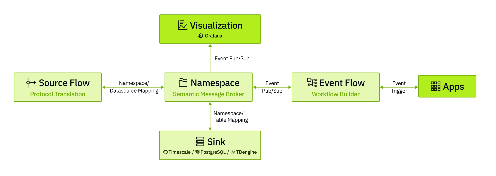

# supOS: An Open-Source IIoT Platform

**supOS** is an open-source industrial data integration platform built on the **Unified Namespace (UNS)** methodology and powered by production-grade open-source technologies.


---

## Architecture Overview


- **Source Flow**  
  Serves as the connection pipeline to devices and systems. It handles real-time protocol translation into JSON payloads. Built entirely on Node-RED.

- **Namespace**  
  The core of supOS. A semantic MQTT broker and parser that models data using topic hierarchies and structured JSON payloads.

- **Sink**  
  The storage layer of supOS.  
  - Time-series Namespace values are stored in **TimescaleDB**, **TDengine**, etc.  
  - Relational Namespace values (e.g., CRM data) are stored in **PostgreSQL**.  
  This enables efficient querying and compression.

- **Event Flow**  
  Orchestrates Namespaces into higher-level event/information flows. Supports merging JSON payloads and appending system-generated prompts for LLM-powered optimization.

---

## Quick Start

### Deployment

> **Note**: supOS is theoretically compatible with any OS running Docker. Currently, it has only been tested on **Ubuntu Server 24.04**. Feedback on other environments is highly appreciated.

1. **Download the image**  
   Clone the repository via Git or download the release zip package. Run the installation script:
   ```bash
   ./startup.sh
   ```

2. **Configure environment variables**  
   Modify the `.env` file based on your deployment needs.

---

## Example Integration Usecase

**Objective**: Integrate work order data (ERP), equipment status (PLC), and quality metrics (Excel) to track execution and send the data to an LLM for root cause analysis.

### Step 1: Create Namespaces

In the **Namespace** section:
- Create folders and files to define a simple structure:
  ```
  Equipment/CNC1
  Order/orderInfo
  Quality/orderQualitylog
  Quality/qualityAnalysis
  ```

- For folders: only name is required.
- For namespaces（file icon）:
  - Choose data type: time-series or relational.
  - Enable **Persistence** if needed.
  - Leave other settings as default.

These actions will generate MQTT topics in supOS’s internal broker.

---

### Step 2: Configure Source Flows

Go to **Source Flow**. Each Namespace automatically generates a Node-RED flow with dummy data.

Update each flow to parse real data using Node-RED nodes:

- **REST API** → Format JSON → Send to `Order/orderInfo`
- **Modbus PLC** → Read status → Format JSON → Send to `Equipment/CNC1`
- **Excel File** → Extract key rows → Format JSON → Send to `Quality/orderQualitylog`


---

### Step 3: Create Event Flow

Using **Event Flow**, connect real-time order and quality data to the LLM and write results back to `Quality/qualityAnalysis`.


At this point, you have completed a integration usecase using supOS.

---

## Experimental Features

### supOS MCP

Allows LLMs to access and interpret real-time UNS content via built-in MCP Server and Client.

**Supported Tools**:

1. `get-model-topic-tree`  
   - Input:
     - `key` (string): Fuzzy search keyword
     - `ShowRec` (boolean): Number of records
     - `type` (string): Search type (1 = text, 2 = tag)
   - Output: Topic tree structure

2. `get-model-topic-detail`  
   - Input: `topic` (string)  
   - Output: Topic metadata

3. `get-topic-realtime-data`  
   - Input: `topic` (string)  
   - Output: Realtime data for the topic

4. `get-all-topic-realtime-data`
   - Output: Realtime data for all related topics

---

### GenUI

After providing a valid `OpenAIAPIKey` in `.env`, you can use **GenUI** to generate HTML apps via natural language — directly interacting with Namespace database tables.

---
## Installation

### 1.Linux

#### 1.1 Operating Environment
- **Operating System**: Currently tested on Ubuntu Server 24.04 with Docker. We welcome feedback on other OS distributions.
- **Docker**: We assume you have Docker (with `docker compose` and `buildx`) installed. Our tested versions:
  - Docker Engine - Community: 27.4.0
  - Docker Buildx: v0.19.2
  - Docker Compose: v2.31.0
  - containerd: 1.7.24
    
#### 1.2 Usage
1. **Clone the project using Git Bash**:
   ```bash
   git clone <this repo>
   ```
2. **Modify the environment variables in the `.env` file**:
   - Navigate to the `supos-ce-deploy` directory and edit the `.env` file.
   - Update `VOLUMES_PATH` (directory for storing project data).
   - Update `ENTRANCE_DOMAIN` (frontend entry domain/IP address).
   - Modify other variables as needed.

3. **Start the project**:
   ```bash
   bash bin/startup.sh
   ```
   - Wait for containers to pull and initialize. The first run may take a few minutes.
     
   If you don’t have Docker installed yet, our scripts can help set it up for Ubuntu Server 24.04. For other operating systems, please refer to the official Docker documentation.

### 2.Windows

#### 2.1 Operating Environment
- Install the latest version of **Docker Desktop** and **Git** on Windows 10 or Windows 11.
- It is recommended to perform all operations in **Git Bash**.

#### 2.2 Usage
1. **Clone the project**:
   ```bash
   git clone <this repo>
   ```
2. **Edit environment variables in the .env file**:
   - VOLUMES_PATH (directory for storing project data)
   - ENTRANCE_DOMAIN (Do not use 127.0.0.1)
   - Any other required variables per your environment

3. **Start the project**:
   ```bash
   bash bin/startup.sh
   ```
   - Wait for containers to pull and initialize. This may take a few minutes on first run.

### 3.Access the Platform
   - Visit `http://<YOUR-DOMAIN>:<YOUR-PORT>` in your browser (based on ENTRANCE_DOMAIN and ENTRANCE_PORT in `.env`).
   - Default superadmin and password : supos/Supos@1304

## License
   - This project is distributed under Apache 2.0. See LICENSE for details.

## Contact
   - If you have questions, open an issue or email us.
## Contributors

We gratefully acknowledge the following individuals for their contributions:

**Wenhao Yu**, **Liebo**, **Weipeng Dong**, **Kangxi**, **Lifang Sun**, **Minghe Zhuang**, **Wangji Xin**, **Fayue Zheng & Yue Yang**, **Yanqiu Liu**, **Dongdong An**, **Jianan Zhu**
